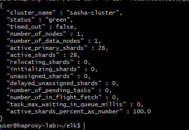
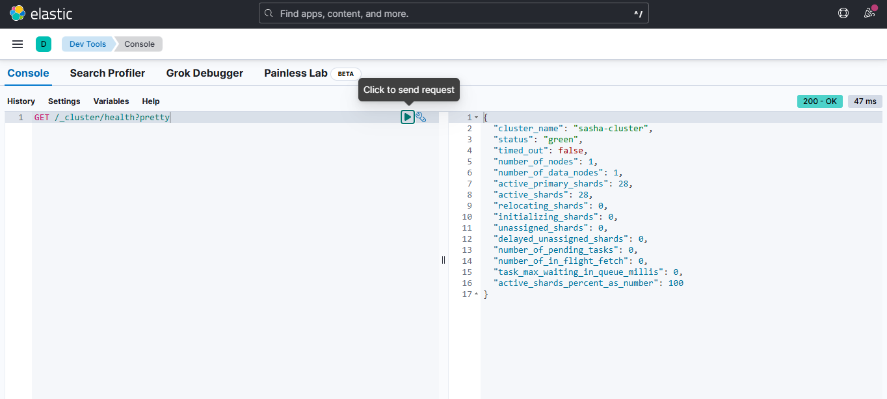
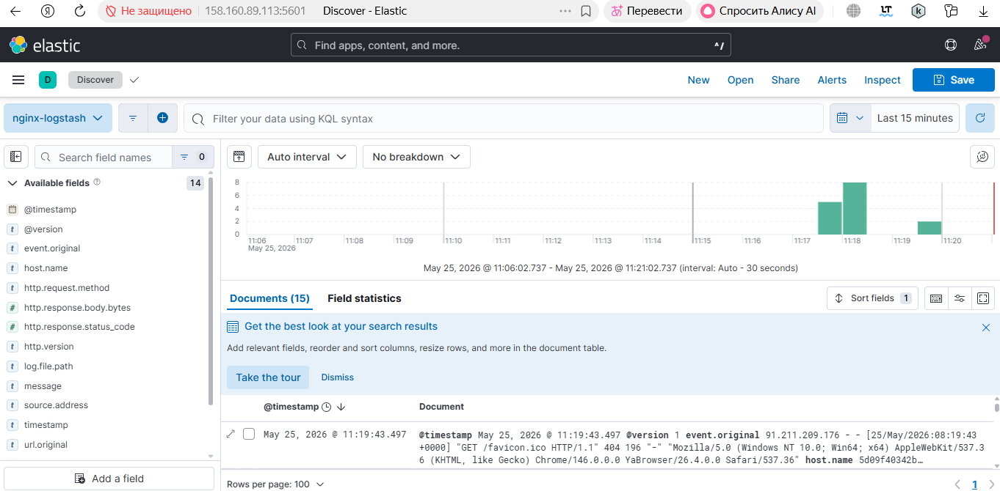
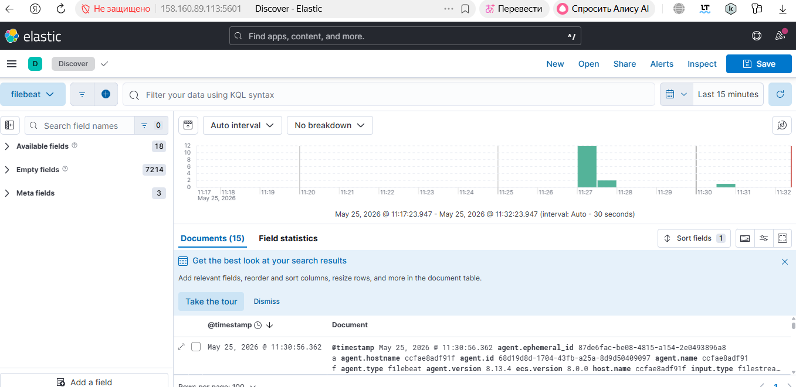

# Домашнее задание «ELK»

Александр Масайлов

---

## Задание 1

Установил Elasticsearch через Docker и изменил имя кластера.

Проверка:

```bash
curl -X GET 'localhost:9200/_cluster/health?pretty'
```

Скриншот:



---

## Задание 2

Установил Kibana и проверил подключение к Elasticsearch через Dev Tools.

Запрос:

```http
GET /_cluster/health?pretty
```

Скриншот:



---

## Задание 3

Установил Logstash и Nginx.
Настроил отправку access логов Nginx в Elasticsearch через Logstash.

Проверка индекса:

```bash
curl 'localhost:9200/_cat/indices?v'
```

Скриншот:



---

## Задание 4

Установил Filebeat и переключил отправку логов Nginx с Logstash на Filebeat.

Проверка индекса filebeat:

```bash
curl 'localhost:9200/_cat/indices?v'
```

Скриншот:


